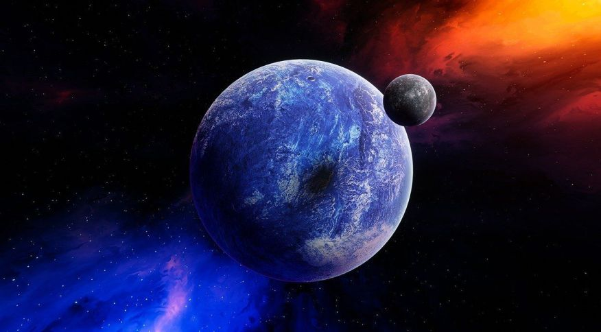

  
  <!--Adicionar logotipo do projeto aqui-->
  

    
  
 

  <h1>Space Battle Game</h1>
  
Um jogo de nave, onde precisamos batalhar para salvar o planeta de um ataque misterioso, desenvolvido em JavaScript

  

    
  
 

  <!--Adicionar imagem/gif do projeto aqui-->
  

       
  

  ## 🚀 Iniciar
  Link do site no Netlify: https://space-battle-game.netlify.app
  
  ## 🔨 Seja um dos contribuidores 
  Quer fazer parte desse projeto? Clique [AQUI](CONTRIBUTING.md) e leia como contribuir.

  <a href='#voltar-topo'>⬆ Voltar ao topo</a> 

